# Naresh Bhosale

**Full-Stack Developer | Co-Founder @ [Navibyte Innovations](https://navibyte.in)**

---

### About

Co-Founder of **[Navibyte Innovations](https://navibyte.in)** — a DPIIT-certified startup incubated at **Savitribai Phule Pune University Research Park**. I specialize in building scalable backend systems and full-stack applications that serve **100K+ users**.

<table>
  <tr>
    <td align="center"><strong>DPIIT Certified</strong> Govt. of India</td>
    <td align="center"><strong>Startup India</strong> Recognized</td>
    <td align="center"><strong>SPPU Incubated</strong> Research Park</td>
    <td align="center"><strong>Olympiad 2025</strong> Winner</td>
  </tr>
</table>

**What I bring to the table:**
- Built **[Abhyasika.online](https://abhyasika.online)** — India's first SaaS for study-room & library management (500+ students enrolled)
- Created **[expo-icon-generator](https://github.com/WebNaresh/expo-icon-generator)** — open-source icon tool for Expo/React Native (28+ stars)
- Built **[pruny](https://github.com/WebNaresh/pruny)** — developer tooling for cleaner codebases (12+ stars)
- Exploring **AI + MCP integrations** — WhatsApp MCP, Instagram MCP for automation

---

### Tech Stack

**Languages & Frameworks**

**Databases & Cloud**

**Tools & Design**

---

### Open Source Projects

| Project | Description | Tech |
|---------|-------------|------|
| [**expo-icon-generator**](https://github.com/WebNaresh/expo-icon-generator) | Generate app icons for Expo/React Native projects | TypeScript, Expo |
| [**pruny**](https://github.com/WebNaresh/pruny) | Developer tool for keeping codebases clean | TypeScript |
| [**SmartKeyboard**](https://github.com/WebNaresh/SmartKeyboard) | Custom Android keyboard application | Kotlin |
| [**TreeView-Generator**](https://github.com/WebNaresh/TreeView-Generator) | VS Code extension — visualize & manage project file structures | TypeScript |
| [**WhatsappMCP**](https://github.com/WebNaresh/WhatsappMCP) | MCP server for AI-powered WhatsApp automation | TypeScript |
| [**NaviLens**](https://github.com/WebNaresh/NaviLens) | AI-powered visual exploration tool | JavaScript |

---

### Client Work — Delivered & Live

> All projects built and shipped through **[Navibyte Innovations](https://navibyte.in/portfolio)**

#### SaaS & Enterprise

| Project | What it does | Live |
|---------|-------------|------|
| [**Abhyasika.online**](https://abhyasika.online) | Study-room & library management SaaS — real-time seat booking, member tracking, automated alerts, analytics. 500+ students enrolled. | [Visit](https://abhyasika.online) |
| [**PracticeStacks**](https://www.practicestacks.in/) | AI-powered proposal & compliance management for enterprises — automated workflows, advanced analytics | [Visit](https://www.practicestacks.in/) |
| [**DemandToKaro**](https://www.demandtokaro.com/) | Hyperlocal demand aggregation marketplace — users post demands, vendors compete with offers | [Visit](https://www.demandtokaro.com/) |

#### Business & Consulting

| Project | What it does | Live |
|---------|-------------|------|
| [**Start Business Consulting**](https://v0-start-business-demo-website.vercel.app/) | Strategy consulting platform — market analysis, growth solutions. Helped 75+ startups. | [Visit](https://v0-start-business-demo-website.vercel.app/) |
| [**Biztree Accounting**](https://v0-biztree.vercel.app/) | Accounting & financial management — automated reporting, expense tracking | [Visit](https://v0-biztree.vercel.app/) |
| [**Rainbow HR Consulting**](https://rainbow-hr-consulting.vercel.app/) | HR platform — talent acquisition, organizational development | [Visit](https://rainbow-hr-consulting.vercel.app/) |

#### Real Estate & Travel

| Project | What it does | Live |
|---------|-------------|------|
| [**Megaaplex**](https://www.megaaplex.com/) | Real estate platform — property discovery, listings, lead management | [Visit](https://www.megaaplex.com/) |
| [**4 Star Travels**](https://www.4startravels.com/) | Travel agency platform — personalized trip planning & booking. 3x increase in bookings. | [Visit](https://www.4startravels.com/) |

#### Non-Profit & Social Impact

| Project | What it does | Live |
|---------|-------------|------|
| [**SnehChhaya**](https://www.snehchhaya.org/) | Child welfare organization — care, education & support for underprivileged children | [Visit](https://www.snehchhaya.org/) |
| [**Green Thumb Foundation**](https://www.greenthumbfoundation.org/) | Environmental conservation — tree planting initiatives. 10,000+ trees planted. | [Visit](https://www.greenthumbfoundation.org/) |
| [**Kaydyach Ani Faydyach**](https://kaydyachaanifaydyach.com/) | Legal rights & government schemes information platform for citizens | [Visit](https://kaydyachaanifaydyach.com/) |

#### Healthcare, Agency & Others

| Project | What it does | Live |
|---------|-------------|------|
| [**Varad Dental Clinic**](https://varad-dental-clinic.vercel.app/) | Dental clinic — service info, online appointment booking, patient resources | [Visit](https://varad-dental-clinic.vercel.app/) |
| [**Pixel Perfects**](https://pixelperfects.in/) | Creative design agency — portfolio, services, client showcase | [Visit](https://pixelperfects.in/) |
| [**Topmind Media**](https://topmindmedia.vercel.app/) | Digital marketing agency — social media growth, video production, brand strategy | [Visit](https://topmindmedia.vercel.app/) |
| [**Godham Group**](https://www.godhamgroup.in/) | Multi-business group — agriculture, sustainability initiatives | [Visit](https://www.godhamgroup.in/) |
| [**Guru Krupa Fire Services**](https://www.gurukrupafireservices.com/) | Fire safety — equipment, training programs, consultation booking | [Visit](https://www.gurukrupafireservices.com/) |

---

### GitHub Stats

  
  

  

---

### Navibyte Innovations

> **"You Imagine, We Build."**

A 3-founder startup building software for startups and enterprises across India. DPIIT-certified, Startup India recognized, and SPPU-incubated.

**Co-Founders:**
- **Vivek Bhos** — Full-stack developer, 5+ years experience, leads technical strategy
- **Naresh Bhosale** — Backend specialist, built systems serving 100K+ users
- **Ajay Pathade** — Growth & marketing, helped 30+ startups expand online

**Services:** Web Apps, Mobile Apps, SaaS Products, Cloud Infrastructure, E-commerce, Digital Marketing

---

**Have a project in mind? Let's talk.**

